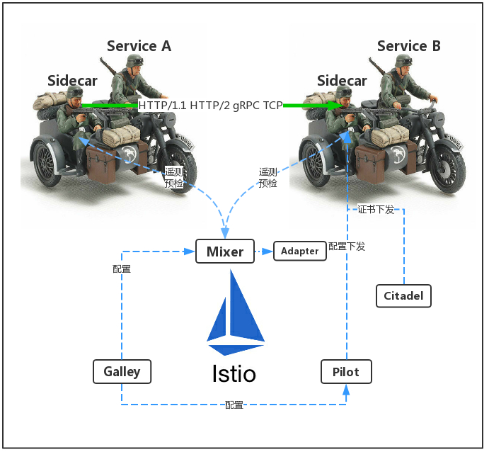
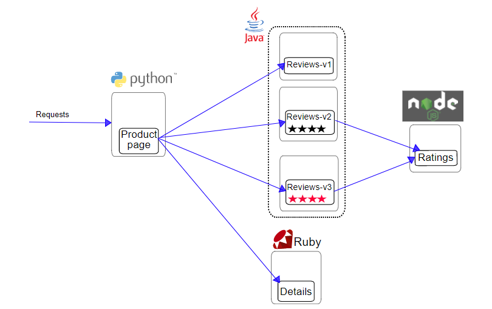

## 20200828

[TOC]

终究还是要回来研究Istio。

https://www.bookstack.cn/read/istio-handbook/concepts-and-principle-istio-architecture.md

### Istio架构




istio的组成

* Citadel：终端用户认证、流量加密
* Galley：验证、处理和分配配置（校验配置是否正确）
* Mixer：访问控制、遥测（访问策略，收集Envoy数据）
* Envoy：智能代理、流量控制（选择Envoy作为Proxy，以sidecar的形式注入到pod中）
* Pilot：服务发现、流量管理 （Envoy的领导，配置下发，告诉Envoy有哪些服务，告诉它流量分配，告诉超时、重试等信息）

还是一脸懵

### Istio解决的问题

故障排查

* 请求在哪失败的？A有调用B吗？
* 为什么用户的请求/页面hung住了？
* 为什么系统这么慢？哪个组件最慢？

应用升级发布

* 新版本一次性升级，一旦出错影响范围很大
* 无法进行A/B测试，根据用户属性访问不同版本
* 服务版本的依赖关系处理不当导致的服务不可用

系统安全

* 服务都是HTTP的，而非HTTPS
* 没有流量限制，任何人都可以对服务发起攻击


官网上面有说明，Istio对pod有要求？比如端口命名等

在chart中只渲染一个模板，使用`-x`选项

```shell
helm template mychart -x templates/deployment.yaml
```


Hold on hold on 等等

### Istio1.3.3 预研思路

1. 知识准备部分

  * 服务网格
  * Istio是什么，架构，核心组件，主要功能
  * 官方Bookinfo应用、编排文件了解
  * 主要功能一：流量管理（virtualService、DestinationRule、ServiceEntry、Gateway/ 动态路由、灰度发布（蓝绿部署、金丝雀发布、A/B测试）/ 超时/重试/熔断）
  * 主要功能二：策略和遥测（限流策略/黑名单、白名单/ 遥测）
  * 主要功能三：可视化（分布式追踪Jaeger/网格可视化Kiali）
  * 主要功能四：安全

2. 实践部分（Bookinfo Demo 借助kubesphere）

  * Istio的安装和部署
  * Bookinfo Demo部署
  * Bookinfo 蓝绿部署
  * Bookinfo 超时
  * Bookinfo 重试
  * Bookinfo 限流
  * Bookinfo 故障注入
  * Bookinfo 黑白名单
  * Prometheus自定义指标收集
  * 使用Jaeger
  * 使用Kiali
  * 加密服务间的流量（？安全）
3. 真实应用部分（？）


###  Bookinfo应用介绍

https://istio.io/docs/examples/bookinfo/ 了解应用介绍

https://github.com/istio/ 下载源代码


部署一个样例应用，它由四个单独的微服务构成，用来演示多种 Istio 特性。这个应用模仿在线书店的一个分类，显示一本书的信息。页面上会显示一本书的描述，书籍的细节（ISBN、页数等），以及关于这本书的一些评论。

Bookinfo 应用分为四个单独的微服务：

- productpage ：productpage 微服务会调用 details 和 reviews 两个微服务，用来生成页面。
- details ：这个微服务包含了书籍的信息。
- reviews ：这个微服务包含了书籍相关的评论。它还会调用 ratings 微服务。
- ratings ：ratings 微服务中包含了由书籍评价组成的评级信息。

reviews 微服务有 3 个版本：

- v1 版本不会调用 ratings 服务。
- v2 版本会调用 ratings 服务，并使用 1 到 5 个黑色星形图标来显示评分信息。
- v3 版本会调用 ratings 服务，并使用 1 到 5 个红色星形图标来显示评分信息。

下图展示了这个应用的端到端架构：




### Bookinfo应用部署

在kubesphere上面搭建环境，没有外网权限，需要修改镜像地址。

docker.io/istio/examples-bookinfo-details-v1:1.15.0

10.6.209.163:5000/kubesphere/examples-bookinfo-productpage-v1:1.13.0

```shell
// 创建命名空间book
# kubectl create ns book

// 给book命名空间设置标签 istio-injection=enabled
# kubectl label namespace book istio-injection=enabled 
# kubectl get ns -L istio-injection

// 部署book应用
# kubectl apply -n book -f samples/bookinfo/platform/kube/bookinfo.yaml

// 删除已部署应用
# kubectl delete -f samples/bookinfo/platform/kube/bookinfo.yaml -n book

// 查看服务运行状态
# kubectl get pods -n book
[root@wh-upos--10 istio-1.3.3]# kubectl  get pods -n book
NAME                             READY   STATUS    RESTARTS   AGE
details-v1-596f79f655-5mh6z      2/2     Running   0          78m
productpage-v1-778fb99b5-bqbhs   2/2     Running   0          78m
ratings-v1-56c99ccf59-h7ch9      2/2     Running   0          78m
reviews-v1-7ddccc48b4-l8q2x      2/2     Running   0          78m
reviews-v2-565645d8cd-j84n5      2/2     Running   0          78m
reviews-v3-58f9dbb6d8-7spl4      2/2     Running   0          78m

// 给Bookinfo应用定义 ingress gateway
# kubectl apply -n book -f samples/bookinfo/networking/bookinfo-gateway.yaml

// 查看gateway和virtualservice
# kubectl  get gateway -n book
NAME               AGE
bookinfo-gateway   3m48s

# kubectl  get virtualservices -n book
NAME       GATEWAYS             HOSTS   AGE
bookinfo   [bookinfo-gateway]   [*]     3m57s

// 查看istio-ingressgateway的ip和port
# kubectl get svc istio-ingressgateway -n istio-system 
NAME                   TYPE       CLUSTER-IP     EXTERNAL-IP   PORT(S)                      AGE
istio-ingressgateway   NodePort   10.43.121.11   <none>        80:31380/TCP,443:31390/TCP   67m

# kubectl -n istio-system get service istio-ingressgateway -o jsonpath='{.spec.ports[?(@.name=="http2")].nodePort}'
31380

# kubectl get po -l istio=ingressgateway -n istio-system -o 'jsonpath={.items[0].status.hostIP}'
10.6.209.26
```

访问浏览器

http://10.6.209.26:31380/productpage


模拟流量

``` shell
watch -n 0.5 curl http://10.6.209.26:31380/productpage
```


### Bookinfo应用清理

**卸载应用**

执行samples/bookinfo/platform/kube/cleanup.sh

$ kubectl  get gateway  -n book

$ kubectl  get virtualservices -n book

$ kubectl  get pods -n book

**卸载 istio**

使用kubectl 卸载 istio

kubectl delete -f install/kubernetes/istio-demo.yaml

手动清除额外的job 资源

kubectl -n istio-system delete job --all

删除CRD

kubectl delete -f install/kubernetes/helm/istio/templates/crds.yaml -n istio-system