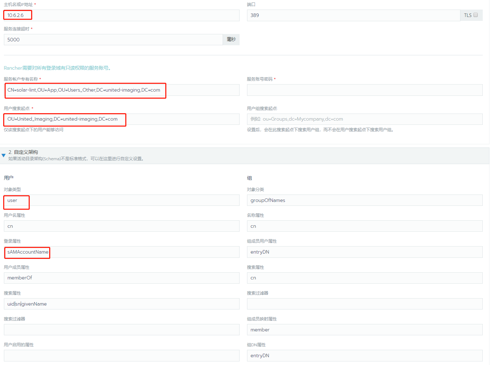

## 20200604

[TOC]

### k8s的认证模型和RBAC模型

角色：代表一组权限规则，权限以累加的方式授予。

角色绑定：将一个角色中定义的各种权限授予一个或者一组用户。

### 对接用户认证系统

Rancher提供本地认证的同时，支持与多种身份验证服务集成。

#### 集成openLDAP

1. 使用初始本地`admin`帐户登录 Rancher UI
2. 在**全局**视图中，导航至**安全 > 认证**
3. 选择 **OpenLDAP**。将显示**配置 OpenLDAP 服务**的表单。

另外需要输入应该映射到本地主体帐户（系统管理员）的 OpenLDAP 帐户的**用户名**和**密码**

设置完成后，使用OpenLDAP中的账号即可正常登录Rancher。

### 角色权限管理

Rancher 依赖于用户和组以确定谁被允许登录到 Rancher，以及他们可以访问哪些资源。

一旦用户登录到 Rancher 中，他们的授权，也就是用户在系统中的访问权限，将由**全局权限**，**集群角色**和**项目角色**决定。

全局权限：定义用户在任何特定集群之外的授权

集群和项目角色：定义用户在分配了角色的集群和项目中的授权

全局权限以及集群和项目角色是基于k8s的RBAC实现的。因此，权限和角色的底层实现是由 Kubernetes 完成的。

Rancher中有两个开箱即用的默认全局权限：系统管理员和标准用户

系统管理员：完全控制整个Rancher系统及其中的所有集群

标准用户：可以创建新集群并使用它们

当用户首次使用外部身份验证系统登录 Rancher 时，会自动为用户分配**新用户默认角色**对应的全局权限，默认为标准用户

怎么查看新用户的默认权限？

全局-》角色，在**全局**选项卡上，有一列名为**新用户默认角色**。

### 添加证书

项目->资源->密文->添加证书

导入私钥key和证书pem文件