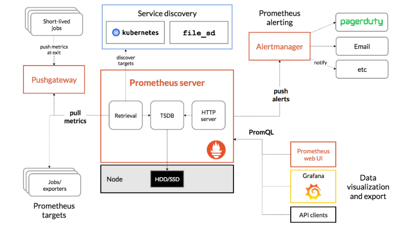
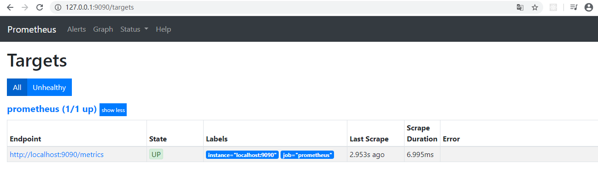
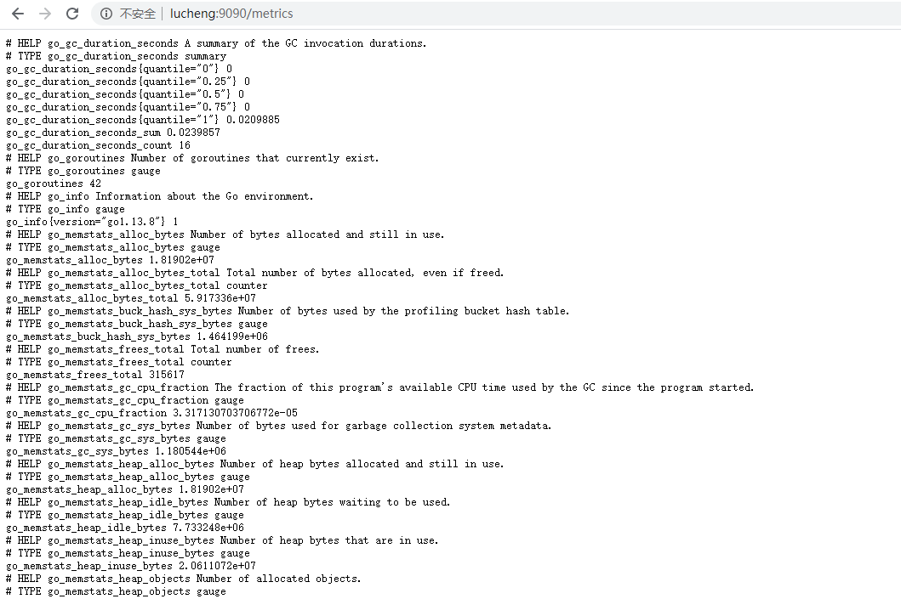
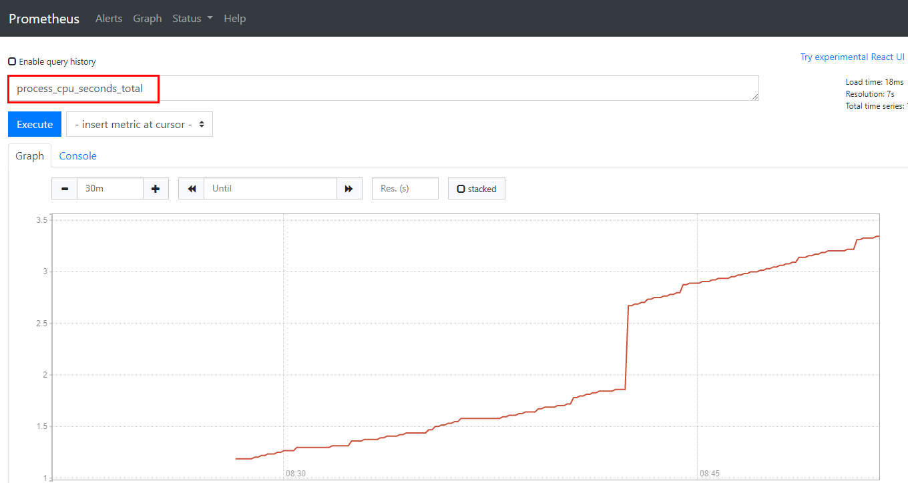

## 20200313

[TOC]

### Prometheus简介

希腊神话人物。

[Prometheus](https://github.com/prometheus) is an open-source systems monitoring and alerting toolkit originally built at SoundCloud。

普罗米修斯是一套开源的监控告警系统（go语言开发）。

### Prometheus特征

什么是**时间序列数据**？按照时间顺序记录系统、设备状态变化的数据。

* 多维度数据模型
* 灵活的查询语言
* 不依赖分布式存储
* 以Http方式，通过pull模型拉取时间序列数据，也支持推送
* 支持多种多样的图标和界面展示

### Prometheus架构图



组件：

* **Prometheus server** 抓取和存储时间序列数据

- **client libraries** for instrumenting application code
- a **push gateway** for supporting short-lived jobs
- special-purpose **exporters** for services like HAProxy, StatsD, Graphite, etc.
- an **alertmanager** to handle alerts
- various support tools

### 安装Prometheus

下载Prometheus

```shell
tar xvfz prometheus-*.tar.gz
cd prometheus-*
```

安装Prometheus

```shell
./prometheus
```

测试是否安装成功

* 检测9090端口占用情况即可
* 访问<http://127.0.0.1:9090/>

### Web基本使用

网页上面选择`status`->`target` 可查看监控的目标。




由上图可知，系统默认监控本机。监控接口：通过http://服务器ip:9090/metrics可以查看到监控信息




查看默认监控图像/比如查看cpu监控图像，(比较少使用)

