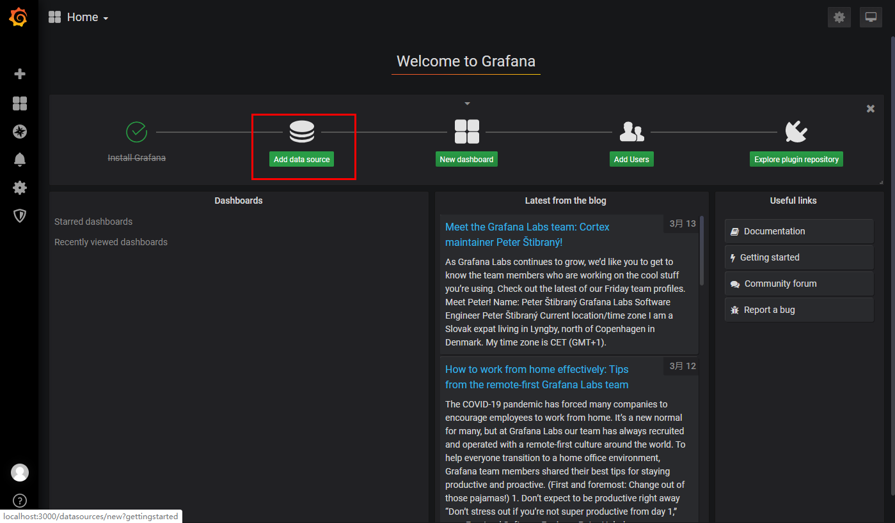
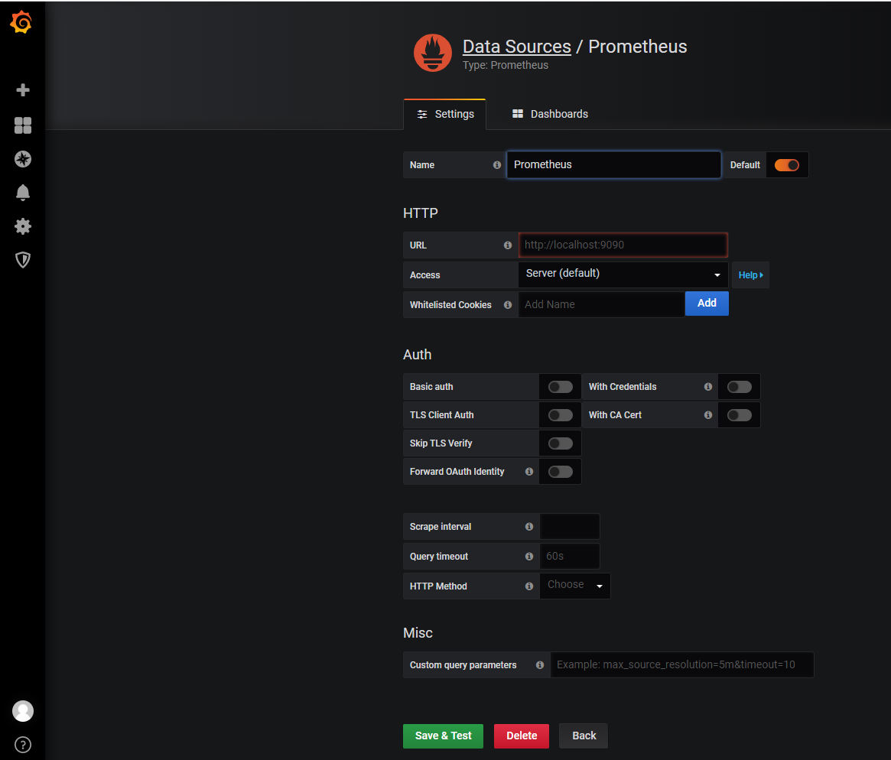

## 20200314

[TOC]

### Prometheus配置文件熟悉

默认配置文件如下：

```yaml
# my global config
global:
  scrape_interval:     15s # Set the scrape interval to every 15 seconds. Default is every 1 minute.
  evaluation_interval: 15s # Evaluate rules every 15 seconds. The default is every 1 minute.
  # scrape_timeout is set to the global default (10s).

# Alertmanager configuration
alerting:
  alertmanagers:
  - static_configs:
    - targets:
      # - alertmanager:9093

# Load rules once and periodically evaluate them according to the global 'evaluation_interval'.
rule_files:
  # - "first_rules.yml"
  # - "second_rules.yml"

# A scrape configuration containing exactly one endpoint to scrape:
# Here it's Prometheus itself.
scrape_configs:
  # The job name is added as a label `job=<job_name>` to any timeseries scraped from this config.
  - job_name: 'prometheus'

    # metrics_path defaults to '/metrics'
    # scheme defaults to 'http'.

    static_configs:
    - targets: ['localhost:9090']

```

### 监控Linux

在远程linux主机（被监控端）上安装node_exporter组件（这样Prometheus就可以接收到其收集系统）

``` shell
# 安装node_exporter

[root@UVM41 tmp]# tar -zxvf node_exporter-1.0.1.linux-amd64.tar.gz 
node_exporter-1.0.1.linux-amd64/
node_exporter-1.0.1.linux-amd64/NOTICE
node_exporter-1.0.1.linux-amd64/node_exporter
node_exporter-1.0.1.linux-amd64/LICENSE

[root@UVM41 tmp]# cd node_exporter-1.0.1.linux-amd64/
[root@UVM41 node_exporter-1.0.1.linux-amd64]# ls
LICENSE  node_exporter  NOTICE

[root@UVM41 node_exporter-1.0.1.linux-amd64]# cp node_exporter /usr/local/bin/

[root@UVM41 node_exporter-1.0.1.linux-amd64]# node_exporter --version
node_exporter, version 1.0.1 (branch: HEAD, revision: 3715be6ae899f2a9b9dbfd9c39f3e09a7bd4559f)
  build user:       root@1f76dbbcfa55
  build date:       20200616-12:44:12
  go version:       go1.14.4
```


运行node_exporter

``` shell
[root@UVM41 node_exporter-1.0.1.linux-amd64]# node_exporter
level=info ts=2020-10-10T03:14:33.084Z caller=node_exporter.go:177 msg="Starting node_exporter" version="(version=1.0.1, branch=HEAD, revision=3715be6ae899f2a9b9dbfd9c39f3e09a7bd4559f)"
level=info ts=2020-10-10T03:14:33.084Z caller=node_exporter.go:178 msg="Build context" build_context="(go=go1.14.4, user=root@1f76dbbcfa55, date=20200616-12:44:12)"
level=info ts=2020-10-10T03:14:33.085Z caller=node_exporter.go:105 msg="Enabled collectors"
level=info ts=2020-10-10T03:14:33.086Z caller=node_exporter.go:112 collector=arp
level=info ts=2020-10-10T03:14:33.086Z caller=node_exporter.go:112 collector=bcache
level=info ts=2020-10-10T03:14:33.086Z caller=node_exporter.go:112 collector=bonding
level=info ts=2020-10-10T03:14:33.086Z caller=node_exporter.go:112 collector=btrfs
level=info ts=2020-10-10T03:14:33.086Z caller=node_exporter.go:112 collector=conntrack
level=info ts=2020-10-10T03:14:33.086Z caller=node_exporter.go:112 collector=cpu
level=info ts=2020-10-10T03:14:33.086Z caller=node_exporter.go:112 collector=cpufreq
level=info ts=2020-10-10T03:14:33.086Z caller=node_exporter.go:112 collector=diskstats
level=info ts=2020-10-10T03:14:33.086Z caller=node_exporter.go:112 collector=edac
level=info ts=2020-10-10T03:14:33.086Z caller=node_exporter.go:112 collector=entropy
level=info ts=2020-10-10T03:14:33.086Z caller=node_exporter.go:112 collector=filefd
level=info ts=2020-10-10T03:14:33.086Z caller=node_exporter.go:112 collector=filesystem
level=info ts=2020-10-10T03:14:33.086Z caller=node_exporter.go:112 collector=hwmon
level=info ts=2020-10-10T03:14:33.086Z caller=node_exporter.go:112 collector=infiniband
level=info ts=2020-10-10T03:14:33.086Z caller=node_exporter.go:112 collector=ipvs
level=info ts=2020-10-10T03:14:33.086Z caller=node_exporter.go:112 collector=loadavg
level=info ts=2020-10-10T03:14:33.086Z caller=node_exporter.go:112 collector=mdadm
level=info ts=2020-10-10T03:14:33.086Z caller=node_exporter.go:112 collector=meminfo
level=info ts=2020-10-10T03:14:33.086Z caller=node_exporter.go:112 collector=netclass
level=info ts=2020-10-10T03:14:33.086Z caller=node_exporter.go:112 collector=netdev
level=info ts=2020-10-10T03:14:33.086Z caller=node_exporter.go:112 collector=netstat
level=info ts=2020-10-10T03:14:33.086Z caller=node_exporter.go:112 collector=nfs
level=info ts=2020-10-10T03:14:33.086Z caller=node_exporter.go:112 collector=nfsd
level=info ts=2020-10-10T03:14:33.086Z caller=node_exporter.go:112 collector=powersupplyclass
level=info ts=2020-10-10T03:14:33.086Z caller=node_exporter.go:112 collector=pressure
level=info ts=2020-10-10T03:14:33.086Z caller=node_exporter.go:112 collector=rapl
level=info ts=2020-10-10T03:14:33.086Z caller=node_exporter.go:112 collector=schedstat
level=info ts=2020-10-10T03:14:33.086Z caller=node_exporter.go:112 collector=sockstat
level=info ts=2020-10-10T03:14:33.086Z caller=node_exporter.go:112 collector=softnet
level=info ts=2020-10-10T03:14:33.086Z caller=node_exporter.go:112 collector=stat
level=info ts=2020-10-10T03:14:33.086Z caller=node_exporter.go:112 collector=textfile
level=info ts=2020-10-10T03:14:33.086Z caller=node_exporter.go:112 collector=thermal_zone
level=info ts=2020-10-10T03:14:33.086Z caller=node_exporter.go:112 collector=time
level=info ts=2020-10-10T03:14:33.086Z caller=node_exporter.go:112 collector=timex
level=info ts=2020-10-10T03:14:33.086Z caller=node_exporter.go:112 collector=udp_queues
level=info ts=2020-10-10T03:14:33.086Z caller=node_exporter.go:112 collector=uname
level=info ts=2020-10-10T03:14:33.086Z caller=node_exporter.go:112 collector=vmstat
level=info ts=2020-10-10T03:14:33.086Z caller=node_exporter.go:112 collector=xfs
level=info ts=2020-10-10T03:14:33.086Z caller=node_exporter.go:112 collector=zfs
level=info ts=2020-10-10T03:14:33.086Z caller=node_exporter.go:191 msg="Listening on" address=:9100
level=info ts=2020-10-10T03:14:33.086Z caller=tls_config.go:170 msg="TLS is disabled and it cannot be enabled on the fly." http2=false
```

可以看到有很多的collector。可以通过--no-collector.arp来禁用某些收集器。

修改prometheus.yml文件，重启prometheus。

``` yaml
scrape_configs:
  # The job name is added as a label `job=<job_name>` to any timeseries scraped from this config.
  - job_name: 'prometheus'
    static_configs:
    - targets: ['localhost:9090']
  
  # 新添加内容
  - job_name: 'node'
    static_configs:
    - targets: ['10.6.5.191:9100']
```

### 安装使用Grafana

prometheus有一个内置的仪表板和图形界面。它非常简单，通常适合查看指标和呈现单个图标。为了给prometheus添加一个功能更加全面的可视化界面，通常与开源仪表板工具Grafana集成。

下载直接安装即可。运行grafana-server.exe，默认端口是3000（在window上面由于端口限制，需要修改成其它端口。复制conf/sample.ini到custom.ini，修改http_port为9999）

使用admin/admin登录，然后需要先将Grafana与我们的Prometheus数据关联起来。

点击Configuration下面的Data Sources，添加Add data source。






出现“Data source is working”，则表明添加数据源成功。

然后创建一个dashboard，从https://grafana.com/grafana/dashboards导入一个存在的Dashboard。

“1 Node Exporter for Prometheus Dashboard CN v20201010” by [StarsL.cn](https://grafana.com/orgs/starsliao)

选择“+“，import，输入id 8919 ，点击Load即可。最终如下图所示：


