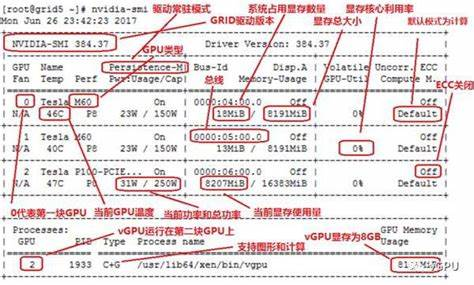

## 20201020

[TOC]

百度词条

NVIDIA已经开发出了五大产品系列，以满足特定细分市场需求，包括：GeForce、Tegra、ION、Quadro、Tesla。

Tegra移动

NVIDIA GPU 技术大会 (GTC) 

NVIDIA TNT 开创时代产品

NVIDIA GEFORCE 为图形和视频所设计的GPU

NVIDIA GoForce 为移动电话所设计的超低能耗手持GPU

NVIDIA QUADRO

数据中心GPU

**Tesla V100 GPU** 基于Volta架构   

**T4 GPU** 基于Turing架构

**A100 GPU**  NVIDIA第八代GPU 基于NVIDIA Ampere架构

2017年5月11日，Tesla V100采用台积电12nm工艺制程，增加了与深度学习高度相关的Tensor单元，在815平方毫米面积的硅片上集成了210亿个晶体管，5210个CUDA核心，其单精度浮点运算性能达到15 TFLOP/s，双精度浮点运算性能达到7.5 TFLOP/s。

显卡命名：

RTX>GTX>GTS>GT>GS

从GTX500系开始，为避免命名复杂带来的产品线识别困扰，NVIDIA显卡将取消GTS级别的显卡，中高端全部使用GTX命名，而低端使用GT命名。同时增设产品细分，带Ti后缀为更高一级显卡，如GTX560Ti>GTX560

我电脑的显卡 NVIDIA GeForce GTX 1060 3GB

GeForce 中文名称精视，面对大众家庭用户，主要娱乐用途，主要是3D游戏 ，GTX10xx

Quadro 专业图形设计卡，比如制图方面，价格比GeForce贵不少

Tesla 服务器专用卡，用于大规模并行计算，非常适合用于机器学习

===========================

官网

[GEFORCE 显卡](https://www.nvidia.cn/geforce/graphics-cards/#intro) （游戏和娱乐）

**GEFORCE RTX 30 系列**  3090、3080、3070

**GEFORCE RTX 20 系列** 2080Ti、2080SUPER、2080、2070、2060

**GEFORCE GTX 16 系列** 1660Ti、1060SUPER、1660、1650

高性能计算

[Tesla](https://www.nvidia.cn/data-center/data-center-gpus/#tesla) （适用于服务器的TESLA数据中心GPU）

训练和推理、高性能计算（HPC）、人工智能

[NVIDIA A100](https://www.nvidia.cn/data-center/a100/)

[NVIDIA A40](https://www.nvidia.cn/data-center/a40/)

[NVIDIA V100](https://www.nvidia.cn/data-center/v100/)

[NVIDIA T4](https://www.nvidia.cn/data-center/tesla-t4/)

[NVIDIA T4 企业服务器](https://www.nvidia.cn/data-center/products/enterprise-server/)

[NVIDIA HGX A100](https://www.nvidia.cn/data-center/hgx/)

[NVIDIA DGX A100](https://www.nvidia.cn/data-center/dgx-a100/)

[NVIDIA DGX 系统](https://www.nvidia.cn/data-center/dgx-systems/)

[NVIDIA EGX 平台](https://www.nvidia.cn/data-center/products/egx-edge-computing/)

[NVIDIA EGX A100](https://www.nvidia.cn/data-center/products/egx-a100/)

P4、P6、P40、M10、M60、M6、V100

黄仁勋于 1993 创立了 NVIDIA，1999年NVIDIA发明了GPU。

可以研究下nvidia-smi、gpu-z

https://www.nvidia.cn/data-center/virtualization/resources/ 这个虚拟化的资料还挺多的

NVIDIA RTX A6000

Quadro RTX 8000

Quadro RTX 6000

Quadro RTX 5000

Quadro RTX 4000

https://www.mydrivers.com/zhuanti/tianti/gpu/index_nvidia.html

http://www.gxlcms.com/server-377913.html

http://vga.zol.com.cn/403/4034835.html

GTX1080、1070、1060、1050、1030、980、970、960、950

**GeForce系列的发展**

1999年8月份，NVIDIA公司发布了第一款GeForce系列：NVIDIA GeForce 256

2000年下半年NVIDIA发布了第二代显示核心GeForce 2系列

2001年2月份NVIDIA推出了第三代GeForce 3系列

2002年NVIDIA推出了第四代产品GeForce 4系列

2002年底NVIDIA显卡进入了GeForce 5时代，第五代主要分为两大系列：GeForce FX和GeForce PCX

2004年4月GeForce 5时代结束，进入到GeForce 6时代，第一款产品为GeForce 6800 Ultra

2005年下半年NVIDIA推出了第七代产品GeForce 7系列

2006年11月NVIDIA正式推出GeForce 8系列第一款显卡NVIDIA GeForce 8800 GTX显卡另外AMD在7月份收购了ATI，从此全球显卡芯片供应商只有AMD和NVIDIA两家。

2008年2月NVIDIA推出了NVIDIA GeForce 9800 GX2显卡，拉开了GeForce 9系列显卡的序幕

2008年6月份的时候NVIDIA推出了第十代产品GeForce 200系列，NVIDIA GeForce GTX 280显卡，现在大家慢慢熟悉了，因为一直到现在还是采用的**NVIDIA GeForce GTX xxx**的命名方式

NVIDIA GeForce 300系列作为NVIDIA的第十一代产品推出，但是该系列的产品都是NVIDIA GeForce 200系列显卡的更名版本

2010年3月份NVIDIA推出了NVIDIA GeForce GTX 480显卡

2010年11月份NVIDIA推出了NVIDIA GeForce 500系列 ，NVIDIA GeForce GTX 580显卡是首款该系列的显卡，第十三代NVIDIA显卡从此拉开序幕

**离我们最近的GeForce 600/700系列**

2012年3月22日NVIDIA推出了NVIDIA GeForce GTX 680显卡，2012年4月29日推出了NVIDIA GeForce 600系列最强的显卡NVIDIA GeForce GTX 690显卡

2013年2月19日NVIDIA推出了卡皇NVIDIA GeForce GTX TITAN，在之后的5月23日，NVIDIA推出了NVIDIA GeForce GTX 780显卡

GTX 900系列 950、960、970、980、980 Ti

GTX 10系列 1030、1050、1060、1070、1080

**GEFORCE GTX 16 系列** 1660Ti、1060SUPER、1660、1650

**GEFORCE RTX 20 系列** 2080Ti、2080SUPER、2080、2070、2060

**GEFORCE RTX 30 系列**  3090、3080、3070

http://www.xitongcheng.com/jiaocheng/dnrj_article_55009.html 2020最新显卡天梯图

GPU基础知识

显卡历史

显卡性能查看

看懂GPU显卡参数

https://www.cnblogs.com/effulgent/archive/2009/01/14/1375845.html

虽然看不到10series的入口了。

https://www.nvidia.cn/geforce/products/10series/architecture/

