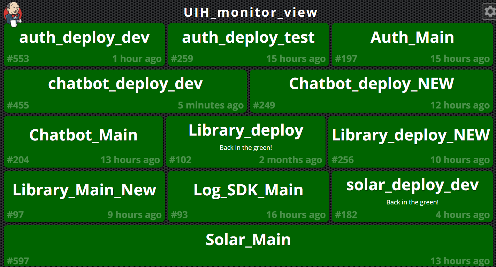

## 20191123

[TOC]

### 使用Green Balls插件

**离线安装插件**

下载对应的插件源码，比如说Green Balls（使构建成功的状态图标为绿色），编译生成greenballs.hpi

```shell
# 下载代码
git clone https://github.com/jenkinsci/greenballs-plugin.git

# 编译
mvn clean package

# 编译生成greenballs.hpi文件
greenballs-plugin-master\target\greenballs.hpi

```

`Jenkins`->`Manage Jenkins`->`Manage Plugins`->`高级`->`上传插件`

选择greenballs.hpi文件点击上传。安装成功后，效果图如下所示：


### 使用Build Monitor View插件

可以将Jenkins项目以一块看板的形式呈现。

选择`Jenkins`->`Manage Jenkins`->`Manage Plugins`>可选插件，在过滤输入框中输入monitor检索

选中build monitor view，点击直接安装



Manage **Jenkins** -> Configure System和Default View 设置默认view