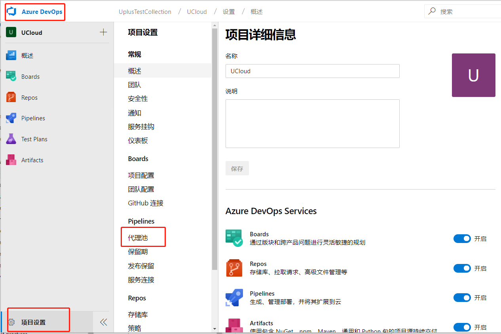
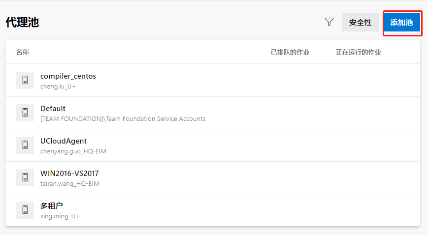
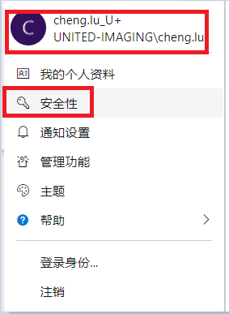
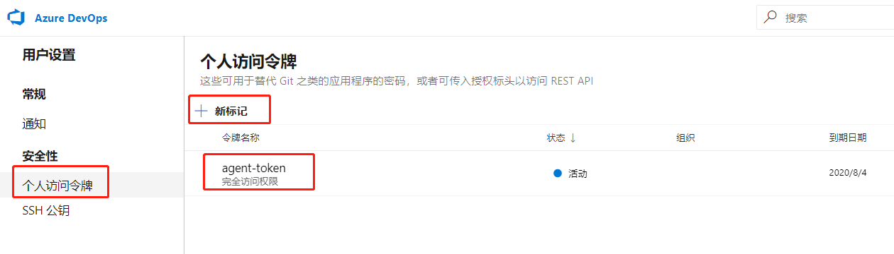
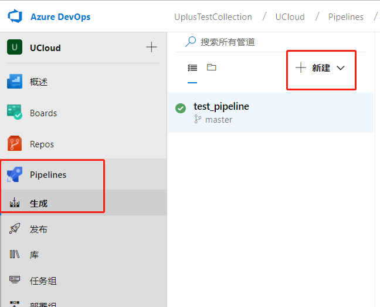
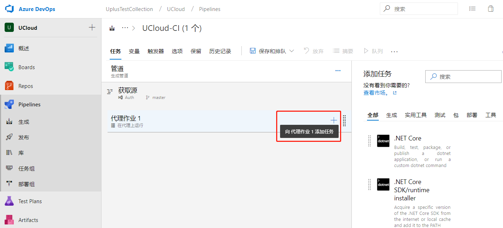

### 20191230

[TOC]

### Azure Pipeline

#### Manage agent & agent pools

使用Azure pipelines 编译代码或者部署软件，你至少需要一个代理agent。job能够直接运行到一台主机或者一个容器里面。

你可能需要并发job同时使用多个代理，多个代理组成一个代理池agent pool。

怎样新建agent pool和agent呢？

1. 新建agent pools

   

   **项目级别或者是集合级别的设置**

   

   新建页面输入“新的代理池名称”，点击"创建"。选择刚刚创建的代理池，点击“新建代理”。按照操作指导下载代理。

   ``` shell
   # 上传agent到agent机器上面。以非root用户进行如下操作：
   [lucheng@master1 lucheng] mkdir myagent && cd myagent
   [lucheng@master1 agent] tar zxvf vsts-agent-linux-x64-2.153.1.tar.gz
   
   [lucheng@master1 agent]$ ./config.sh
   
   >> 最终用户许可协议:
   
   从 TFVC 存储库生成源要求接受 Team Explorer Everywhere 最终用户许可协议。本步骤不是从 Git 存储库生成源所必需的。
   
   可在以下位置找到 Team Explorer Everywhere 许可协议的副本:
     /home/lucheng/agent/externals/tee/license.html
   
   输入 是否现在接受 Team Explorer Everywhere 许可协议? (是/否) (对于 N 按 Enter) > 
   
   >> 连接:
   
   输入 服务器 URL > https://navi.united-imaging.com
   输入 身份验证类型 (对于 PAT 按 Enter) > 
   输入 身份验证类型 (对于 PAT 按 Enter) > 
   输入 个人访问令牌 > h5ahnb5c3w3xjynx3kukxwqas7ybfuaxflbnospd6tzjwdphre7q
   正在连接到服务器...
   // uv5h5eofsn7oedphpq5zgxxajq46huj7vwimjrzj2cglt3ybyyja
   // 或者使用negotiate,输入用户名和密码
   >> 注册代理:
   输入 代理池 (对于 default 按 Enter) > compiler_centos
   输入 代理名称 (对于 master1 按 Enter) > compiler_209
   正在扫描工具功能。
   正在连接到服务器。
   正在测试代理连接。
   输入 工作文件夹 (对于 _work 按 Enter) > 
   2020-06-11 05:26:05Z: 设置已保存。
   
   [lucheng@master1 agent]$ ./run.sh
   正在扫描工具功能。
   正在连接到服务器。
   2020-06-11 05:27:16Z: 侦听作业
```
   
另外其中需要输入PAT，按照如下步骤可以生成获取到PAT。
   

   
如图，创建个人访问令牌
   

   
   

#### 简介

You can use many languages with Azure Pipelines, such as Python, Java, JavaScript, PHP, Ruby, C#, C++, and Go.

支持多种语言


管道有两种类型：build pipeline 生成管道，release pipeline 发布管道

定义pipeline有两种方式：使用YAML syntax或者Classic interface

如果使用YAML
1. Configure Azure Pipelines to use your Git repo
2. Edit your azure-pipelines.yml file to define your build
3. Push your code to your version control repository. This action kicks off the default trigger to build and deploy and then monitor the results


如果使用classic interface
1. Configure Azure Pipelines to use your Git repo
2. Use the Azure Pipelines classic editor to create and configure your build and release pipelines
3. Push your code to your version control repository. This action triggers your pipeline and runs tasks such as building or testing code

究竟选用哪种方式呢？

官方文档上面有说面这两种方式哪些方面支持哪些方面不支持的列表，但是没有说明推荐使用哪种方式。

#### 创建第一个pipeline

选择“pipeline”，点击“新建”，选择“新建生成管道”



选择“使用经典编辑器”，创建没有YAML的管道。

选择“团队项目”-》“存储库”-》用于手动生成和计划生成的默认分支。点击“继续”，选择”空作业“。



