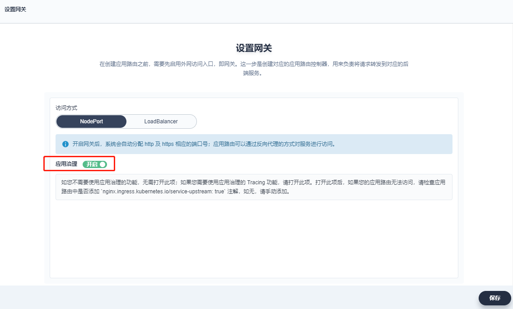

## 20200831

[TOC]

### 部署bookinfo(Kubesphere)

使用的是预生产环境10.6.209.163

``` shell
# istioctl version
client version: 1.3.3
control plane version: 1.3.3
```

按照如下步骤操作

1. 使用管理员账号 `admin`在示例项目 `demo-project`下选择 「项目设置」→「高级设置」→「设置网关」，点击「应用治理」的开启按钮。如下图所示：




2. 进入项目 demo-project 后，选择 `应用负载`→ `应用`，点击 「部署示例应用」

3. 访问bookinfo应用

   http://productpage.book.10.6.209.163.nip.io:31844/productpage

   神奇，怎么没添加host就能访问呢？

   

### 灰度发布

1. 选择 「灰度发布」，点击 「发布灰度任务」

2. 在跳转的灰度发布页面，选择 「金丝雀发布」 作为灰度策略，点击 「发布任务」

3. 在弹窗中，填写发布任务名称为 `bookinfo-canary`，点击 「下一步」

4. 点击 `reviews`一栏的 「选择」，即选择对应用组件 `reviews`进行灰度发布，点击 「下一步」（只能选择一个微服务？？）

5. 填写灰度版本信息

   灰度版本号：v2；

   镜像：istio/examples-bookinfo-reviews-v2:1.13.0

6. 允许按流量比例下发与按请求内容下发等两种发布策略。选择 **按流量比例下发**，流量比例选择 v1 与 v2 各占 **50 %**，点击 「创建」


http://productpage.book.10.6.209.163.nip.io:31844/productpage

``` shell
// 模拟
 watch -n 0.5 curl http://productpage.book.10.6.209.163.nip.io:31844/productpage
```

### 查看 Tracing


### 熔断

在微服务中，系统的各个服务之间在网络上存在大量的调用，在调用过程中，如果某个服务繁忙或者无法响应请求，可能会引发集群的大规模级联故障，从而造成整个系统不可用，引发服务雪崩效应。当下游服务因访问压力过大而响应变慢或失败，上游服务为了保护系统整体的可用性，可以暂时切断对下游服务的调用，达到服务降级的效果，通过牺牲局部保全整体的措施就叫做**熔断（Circuit Breaking）**。


在流量治理的流量拓扑图中，点击一个服务，在右侧展开「流量治理」，打开 「连接池管理」 和 「熔断器」。

何为连接池？以及它的设置项是些什么意思？

熔断器的设置项？


| 最大连接数       | 是指 Envoy 将为上游群集中的所有主机建立的最大连接数，适用于 HTTP/1.1。 |
| ---------------- | ------------------------------------------------------------ |
| 每连接最大请求数 | 对某一后端的请求中，一个连接内能够发出的最大请求数量。对后端连接中最大的请求数量若设为 1 则会禁止 keep alive 特性。 |
| 最大请求重试次数 | 在指定时间内对目标主机最大重试次数。                         |
| 连接超时时间     | TCP 连接超时时间，最小值必须大于 1ms。 最大连接数和连接超时时间是对 TCP 和 HTTP 都有效的通用连接设置 |
| 最大等待请求数   | 等待列队的长度，默认为 1024。                                |

| **参数**                | **参数说明**                                                 |
| :---------------------- | :----------------------------------------------------------- |
| 连续错误响应个数        | 在一个检查周期内，连续出现 5xx 状态码的错误的个数，超过该值后，实例将会被移出连接池。 |
| 检查周期 (单位: s)      | 将会对检查周期内的响应码进行筛选，检测实例上一次被移除和这一次被移除之间的时间间隔。默认值为 10s，最小值为 1ms。 |
| 容器组隔离比例(单位: %) | 上游服务的负载均衡池中允许被移除的实例的最大百分比，采用向上取整。 |
| 最短隔离时间 (单位: s)  | 实例最短的移除时间。实例每次被移除后的隔离时间为被移除的次数与最小移除时间的乘积。该策略设置让系统能够自动增加不健康上游服务实例的隔离时间。 |


进入到review容器测试熔断

```shell
kubectl exec -n book -it reviews-v2-855764b9bc-dpnb9 -c reviews /usr/bin/fortio -- load -curl http://ratings:9080/ratings/0


kubectl exec -n book -it reviews-v2-855764b9bc-dpnb9 -c reviews /usr/bin/fortio -- load -c 2 -qps 0 -n 20 -loglevel Warning http://ratings:9080/ratings/0
```

