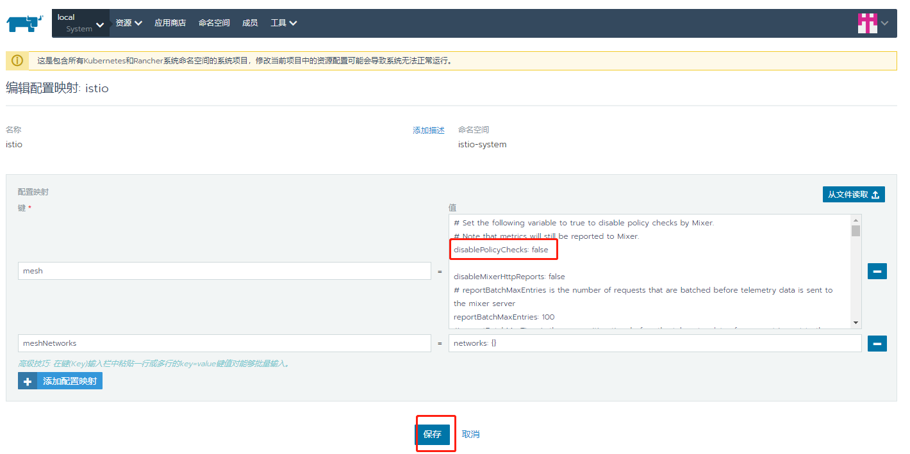

## 20200901

[TOC]

### Bookinfo编排

每个微服务定义了Service，对应的Deployment (reviews存在多个版本，其它只有v1版本）。

productpage v1版本

reviews v1, v2, v3版本 

ratings v1版本

details v1 版本


### Rancher实操Istio准备

选择集群-》工具 -》Istio，在Rancher上面打开istio开关，注意开启Ingress网关。

按照之前文档部署完bookinfo demo即可。


### 流量管理

流量管理是服务网格主要的功能之一。要控制流量，就需要定义一些规则。首先有必要了解下与规则配置相关的重要概念和基本的配置方法。

4中配置资源：

| 配置资源                   | 说明                                       |
| -------------------------- | ------------------------------------------ |
| 虚拟服务（VirtualService)  | 用来定义路由规则，控制请求如何被路由到服务 |
| 目标规则（DestinationRule) | 用来配置请求的策略                         |
| 服务入口（ServiceEntry)    | 用来定义从外部如何访问服务网格             |
| 网关（Gateway)             | 在网格的入口设置负载、控制流量等           |

**virtualservice:** 

定义路由规则，使请求可以依据这些规则被分发到对应的服务。路由规则可以是根据路径、头信息、服务版本进行路由。

通过hosts关键字指定目标主机（服务）

通过weight来拆分流量

#### 流量转移（traffic shifting）

示例：根据不同的版本对服务流量进行拆分。reviews服务有三个版本，把80%的流量分配给v1版本的reviews服务，20%的流量分配给v2版本。

需要如下图所示定义virtualservice：

``` yaml
# virtual-service-reviews-80-20.yaml
apiVersion: networking.istio.io/v1alpha3
kind: VirtualService
metadata:
  name: reviews
spec:
  hosts:
    - reviews
  http:
  - route:
    - destination:
        host: reviews
        subset: v1        // 对应DestinationRule中的定义
      weight: 80
    - destination:
        host: reviews
        subset: v2
      weight: 20
```

需要说明下subset, 特定版本的标签，他和标签的映射关系定义在destinationrule里。

``` yaml
# destination-rule-all.yaml
apiVersion: networking.istio.io/v1alpha3
kind: DestinationRule
metadata:
  name: reviews
spec:
  host: reviews
  subsets:
  - name: v1  
    labels:
      version: v1        // 真实的pod标签
  - name: v2
    labels:
      version: v2
  - name: v3
    labels:
      version: v3
```

即只有附带这个标签（version: vx）的pod才能接受流量。

``` shell
kubectl apply -n book -f destination-rule-all.yaml
kubectl apply -n book -f virtual-service-reviews-80-20.yaml
```

刷新页面可以看到效果，10次中8次访问到v1版本reviews服务，2次访问到v2版本reviews服务。

实际中使用的场景：蓝绿部署、金丝雀发布和A/B测试

这几个概念要了解下？

#### 请求路由（request routing）

示例：特定的用户访问特定版本，在这个例子中，Jason用户的流量将路由到reviews的第二个版本。

需要如下图所示定义virtualservice：

``` yaml
# virtual-service-reviews-test-v2.yaml

apiVersion: networking.istio.io/v1alpha3
kind: VirtualService
metadata:
  name: reviews
spec:
  hosts:
    - reviews
  http:
  - match:
    - headers:
        end-user:
          exact: jason
    route:
    - destination:
        host: reviews
        subset: v2
  - route:
    - destination:
        host: reviews
        subset: v1
```

#### 故障注入

resiliency：弹性

Istio提供了两种故障注入的能力，分别是延迟和中断。

示例：在reviews:v2 和 ratings 微服务间注入7s的延迟

``` yaml
# virtual-service-ratings-test-delay.yaml
apiVersion: networking.istio.io/v1alpha3
kind: VirtualService
metadata:
  name: ratings
spec:
  hosts:
  - ratings
  http:
  - match:
    - headers:
        end-user:
          exact: jason
    fault:
      delay:
        percentage:
          value: 100
        fixedDelay: 7s
    route:
    - destination:
        host: ratings
        subset: v1
  - route:
    - destination:
        host: ratings
        subset: v1
```

使用fault delay关键字，fixedDelay: 7s  

延迟的目的就是来捕获这些正常情况下难以发现的问题。


中断故障

示例：直接让 ratings 微服务间返回500错误

使用fault Abort关键字

```yaml
fault:
  abort:
    Http Status:  500
    Percent:      100
```
#### 超时、重试

``` yaml
// 首先将所有流量导向到v1版本。
# kubectl apply -n book -f virtual-service-all-v1.yaml

// 修改reviews的虚拟服务，将请求路由到 reviews 服务的 v2 版本，它会发起对 ratings 服务的调用
# kubectl apply -n book -f - <<EOF
apiVersion: networking.istio.io/v1alpha3
kind: VirtualService
metadata:
  name: reviews
spec:
  hosts:
    - reviews
  http:
  - route:
    - destination:
        host: reviews
        subset: v2
EOF

// 给rating服务注入2s的延迟
# kubectl apply -n book -f - <<EOF
apiVersion: networking.istio.io/v1alpha3
kind: VirtualService
metadata:
  name: ratings
spec:
  hosts:
  - ratings
  http:
  - fault:
      delay:
        percent: 100
        fixedDelay: 2s
    route:
    - destination:
        host: ratings
        subset: v1
EOF


// 现在给reviews服务增加一个1s的延迟
# kubectl apply -n book -f - <<EOF
apiVersion: networking.istio.io/v1alpha3
kind: VirtualService
metadata:
  name: reviews
spec:
  hosts:
  - reviews
  http:
  - route:
    - destination:
        host: reviews
        subset: v2
    timeout: 0.5s   //设置timeout即可
EOF
```

刷新页面，这时候应该看到 1 秒钟就会返回，而不是之前的 2 秒钟，但 `reviews` 是不可用的。

默认情况下请求超时是禁用的。 `reviews` 服务在处理请求时会接着调用 `ratings` 服务，用 Istio 在对 `ratings` 的调用中注入了两秒钟的延迟，这样就让 `reviews` 服务要花费超过半秒的时间来完成调用，因此可以观察到超时。


重试暂时放着。

#### 熔断（circuit-breaking）

熔断能够使您的应用程序具备应对来自故障、潜在峰值和其他 未知网络因素影响的能力。

下面这个例子中，我们配置熔断规则，然后通过有意的使熔断器“跳闸”来测试配置。

1. 配置熔断器

``` yaml
// 注意在DestinationRule中配置
  
# kubectl apply -n book -f - <<EOF
apiVersion: networking.istio.io/v1alpha3
kind: DestinationRule
metadata:
  name: httpbin
spec:
  host: httpbin
  trafficPolicy:
    connectionPool:
      tcp:
        maxConnections: 1
      http:
        http1MaxPendingRequests: 1
        maxRequestsPerConnection: 1
    outlierDetection:
      consecutiveErrors: 1
      interval: 1s
      baseEjectionTime: 3m
      maxEjectionPercent: 100
EOF
```

#### 流量镜像

virtualservice中定义mirror

``` yaml
    mirror:
      host: httpbin
      subset: v2
    mirror_percent: 100
```

### 策略

首先需要开启策略检查

``` shell
// 查询
# kubectl -n istio-system get cm istio -o jsonpath="{@.data.mesh}" | grep disablePolicyChecks
disablePolicyChecks: true

// 这个在rancher上面不好使
# istioctl manifest apply --set values.global.disablePolicyChecks=false --set values.pilot.policy.enabled=true configuration "istio" replaced

```

修改istio configmap, 设置disablePolicyChecks: false 如下图所示。注意还要重启istio-pilot，否则不生效



#### Denials和黑白名单

``` yaml
# 应用简单的Denials规则
kubectl apply -f samples/bookinfo/policy/mixer-rule-deny-label.yaml

apiVersion: "config.istio.io/v1alpha2"
kind: handler
metadata:
  name: denyreviewsv3handler
spec:
  compiledAdapter: denier
  params:
    status:
      code: 7
      message: Not allowed
---
apiVersion: "config.istio.io/v1alpha2"
kind: instance
metadata:
  name: denyreviewsv3request
spec:
  compiledTemplate: checknothing
---
apiVersion: "config.istio.io/v1alpha2"
kind: rule
metadata:
  name: denyreviewsv3
spec:
  match: destination.labels["app"] == "ratings" && source.labels["app"]=="reviews" && source.labels["version"] == "v3"
  actions:
  - handler: denyreviewsv3handler
    instances: [ denyreviewsv3request ]
```

三种类型的资源：handler，instance， rule

现象，应用规则前：

已登出或以非 “json” 用户登录，看到红色星标。

如果您以 “json” 用户登录，可以一直看到黑色星标。

应用规则后：

已登出或以非 “json” 用户登录，不会看到红色星标。

如果您以 “json” 用户登录，可以一直看到黑色星标。


``` yaml
# kubectl apply -n book -f mixer-rule-deny-whitelist.yaml

apiVersion: config.istio.io/v1alpha2
kind: handler
metadata:
  name: whitelist
spec:
  compiledAdapter: listchecker
  params:
    # providerUrl: ordinarily black and white lists are maintained
    # externally and fetched asynchronously using the providerUrl.
    overrides: ["v1", "v2"]  # overrides provide a static list
    blacklist: false       // true为黑名单，false为白名单
---
apiVersion: config.istio.io/v1alpha2
kind: instance
metadata:
  name: appversion
spec:
  compiledTemplate: listentry
  params:
    value: source.labels["version"]
---
apiVersion: config.istio.io/v1alpha2
kind: rule
metadata:
  name: checkversion
spec:
  match: destination.labels["app"] == "ratings"
  actions:
  - handler: whitelist
    instances: [ appversion ]
---
```

基于IP的白名单

``` yaml
# kubectl apply -n book -f mixer-rule-deny-ip.yaml  
```

这个还没太理解，搞得我的etcd访问好像都有问题了。

