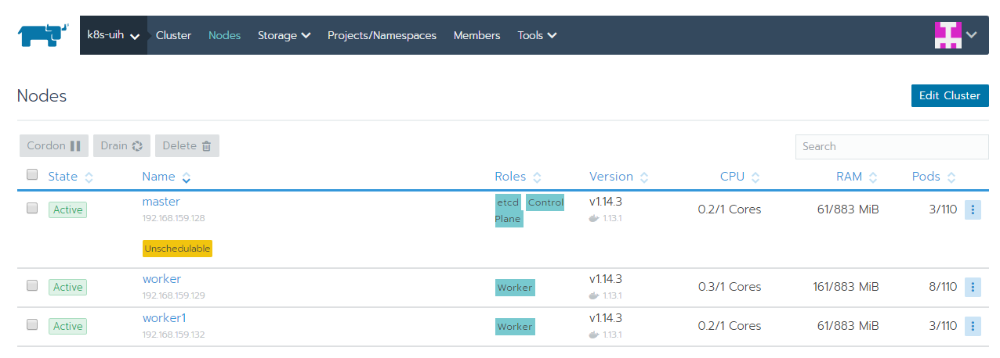

## 20190803

[TOC]

### 使用Rancher搭建K8S集群

- Provision Linux Host  
- Install Rancher
- Log In

- Create the Cluster

#### 准备

虚拟机准备：

* 机器1：ubuntu 18.04 运行 Rancher 192.168.159.131

* 机器2：centos7  k8s Master 192.168.159.128

* 机器3：centos7  k8s Worker 192.168.159.129

* 机器4：centos7  k8s Worker2 192.168.159.132


1. 关闭机器2,3,4的防火墙

   ```
   // 登录机器，执行如下命令
   systemctl status firewalld
   systemctl stop firewalld
   systemctl status firewalld
   ```

2. 修改hostname(默认都是localhost，需要修改)

   ```
   // 登录机器，执行如下命令
   hostnamectl set-hostname xxx , 按照机器用途，起名为rancher-web, master, worker1, worker2 
   
   // 修改/etc/hosts文件
   127.0.0.1 localhost
   192.168.159.131 rancher-web
   192.168.159.128 master
   192.168.159.129 worker1
   192.168.159.132 worker2
   
   // 重启
   reboot -f
   ```

#### 运行Rancher

1. 登录机器1，安装docker version > 18.09.2

   ```
   sudo apt install docker.io
   ```

2. 运行如下命令

   ```shell
   sudo docker run -d --restart=unless-stopped -p 80:80 -p 443:443 rancher/rancher:stable
   ```

3. 访问https://<server_ip>

   设置admin密码

#### 添加集群


点击**Add Cluster**


创建集群页选择**Custom**

**Cluster Name**：XXX

**Network Provider**：选择Flannel

**Cloud Provider**：选择None


选择etcd和Control Plane，拷贝生成的命令行，登录master机器执行拷贝的命令行

```
sudo docker run -d --privileged --restart=unless-stopped --net=host -v /etc/kubernetes:/etc/kubernetes -v /var/run:/var/run rancher/rancher-agent:v2.2.5 --server https://192.168.159.131 --token dnzq6dfl4zvf6t4htpdl5cbhw2gt789q4kxvwsrrztl24bbfql6556 --ca-checksum c4312f6c9fb27c85f17b036b5efa9a2a9a5e523a1fead9439f347fce1712f187 --etcd --controlplane
```


选择worker，拷贝生成的命令行，登录worker节点机器执行拷贝的命令行

```
sudo docker run -d --privileged --restart=unless-stopped --net=host -v /etc/kubernetes:/etc/kubernetes -v /var/run:/var/run rancher/rancher-agent:v2.2.5 --server https://192.168.159.131 --token dnzq6dfl4zvf6t4htpdl5cbhw2gt789q4kxvwsrrztl24bbfql6556 --ca-checksum c4312f6c9fb27c85f17b036b5efa9a2a9a5e523a1fead9439f347fce1712f187 --worker
```


视网络情况下，大概10分钟后，集群显示创建成功


查看对应集群的节点如下图显示




