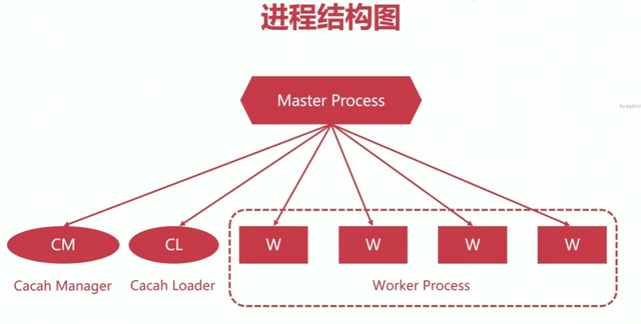

## 20200521

[TOC]

### Nginx进程结构




```shell

[root@node5 conf.d]# ps -ef |grep nginx
nginx     54377  61862  0 13:48 ?        00:00:00 nginx: worker process
nginx     54378  61862  0 13:48 ?        00:00:00 nginx: worker process
nginx     54379  61862  0 13:48 ?        00:00:01 nginx: worker process
nginx     54380  61862  0 13:48 ?        00:00:02 nginx: worker process
root      61862      1  0 Jan10 ?        00:00:08 nginx: master process /usr/sbin/nginx

```

nginx has one **master process** and several **worker processes**. 

The main purpose of the master process is to read and evaluate configuration, and maintain worker processes.


### Reload重载配置文件

不停机生效新的配置


预备知识：

利用信号管理Nginx

SIGHUP 重新读取配置文件

SIGKILL  强制杀死进程

SIGCHILD 用于父子进程之间通信

SIGTERM 优雅的关闭进程


reload重载配置文件的流程

1. 向master进程发送HUP进程（reload命令）
2. master进程检查配置文件语法是否正确
3. master进程打开监控端口
4. master进程使用新的配置文件启动新的worker子进程
5. master进程向老的worker子进程发送QUIT信号
6. 旧的worker进程关闭监听句柄，处理完当前连接后关闭进程


### Nginx的热部署

热升级的流程

1. 将旧的nginx文件替换成新的nginx文件
2. 向master进程发送USR2信号
3. master进程修改pid文件，加后缀.oldbin
4. master进程使用新nginx文件启动新master进程
5. 向旧的master进程发送WINCH信号，旧的worker子进程发送QUIT
6. 回滚情形：向旧master发送HUP，向新的master发送QUIT

```shell
[root@node5 nginx]# nginx -V
nginx version: nginx/1.16.1
built by gcc 4.8.5 20150623 (Red Hat 4.8.5-39) (GCC) 
built with OpenSSL 1.0.2k-fips  26 Jan 2017
TLS SNI support enabled
configure arguments: --prefix=/usr/share/nginx --sbin-path=/usr/sbin/nginx --modules-path=/usr/lib64/nginx/modules --conf-path=/etc/nginx/nginx.conf --error-log-path=/var/log/nginx/error.log 

kill -s SIGUSR2 27394 //新老master都存在

kill -s SIGWINCH 27394 //旧worker进程退出

kill -s SIGQUIT 27394
```


### Nginx的模块化管理机制


### Nginx的安装

1. Nginx packages

```shell
yum install nginx
```

2. Building from Sources

http://nginx.org/en/docs/configure.html

```shell
./configure
    --sbin-path=/usr/local/nginx/nginx
    --conf-path=/usr/local/nginx/nginx.conf
    --pid-path=/usr/local/nginx/nginx.pid
    --with-http_ssl_module
    --with-pcre=../pcre-8.44
    --with-zlib=../zlib-1.2.11
make
make install

// 使用./configure --help 查看配置
```

常见编译安装的配置参数

--prefix	指定安装的目录

--user	运行nginx的worker子进程的属主

--group	运行nginx的worker子进程的属组

--pid-path	存放进程运行pid文件的路径

--conf-path	配置文件nginx.conf的存放路径

--error-log-path	错误日志error.log的存放路径

--http-log-path	访问日志access.log的存放路径

--with-pcre	pcre库的存放路径，源码路径（正则表达式会用到）

--with-zlib	zlib库的存放路径（压缩功能）


``` shell
./configure --prefix=/opt/nginx --conf-path=/opt/nginx/conf/nginx.conf --user=nginx --group=nginx --pid-path=/opt/nginx/pid/nginx.pid --error-log-path=/opt/nginx/error.log --with-pcre=/opt/src/pcre-8.43 --with-zlib=/opt/src/zlib-1.2.11 --http-log-path=/opt/nginx/logs/access.log


./configure: error: C compiler cc is not found
yum install gcc gcc-c++


[root@localhost nginx]# /opt/nginx/sbin/nginx 
nginx: [emerg] getpwnam("nginx") failed

useradd nginx

```

