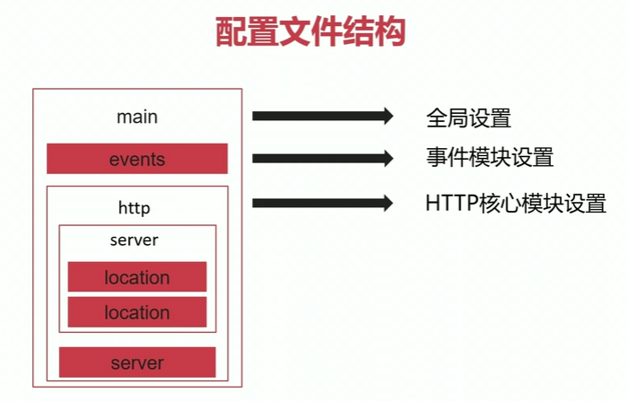

## 20200525

[TOC]

### 配置文件



修改配置文件nginx.conf

worker_processes  auto;

```shell
[root@localhost nginx]# /opt/nginx/sbin/nginx  -s reload

[root@localhost ~]# ps -ef |grep nginx
root     49461     1  0 12:26 ?        00:00:00 nginx: master process /opt/nginx/sbin/nginx -c /opt/nginx/conf/nginx.conf
nginx    50094 49461  0 12:28 ?        00:00:00 nginx: worker process
nginx    50095 49461  0 12:28 ?        00:00:00 nginx: worker process
nginx    50096 49461  0 12:28 ?        00:00:00 nginx: worker process
nginx    50097 49461  0 12:28 ?        00:00:00 nginx: worker process
```

worker_connections  1024;

每一个worker进程能够处理的最大并发数

listen       9988;

修改监听端口

具体可以修改http://nginx.org/en/docs/ Modules reference


### Serving Static Content

An important web server task is serving out files。

mkdir -p /data/www

mkdir -p /data/images

/data/www/中新增index.html文件

/data/images中新增me.jpg文件

修改配置文件nginx.conf

```shell
 server {
    listen       9988;

    location / {
        root /data/www;
    }

    location /images/ {
        root /data;
    }

 }
```
访问

http://192.168.159.155:9988/ ---> /data/www/index.html

http://192.168.159.155:9988/images/me.jpg ---> /data/images/me.jpg


### Setting Up a Simple Proxy Server

One of the frequent uses of nginx is setting it up as a proxy server,which means a server that receives requests, passes them to the proxied servers, retrieves responses from them, and sends them to the clients.

mkdir -p /data/up1

```shell
server {
    listen     9999;
    root /data/up1;  //该server段内，全局生效

    location / {
    }
 }
 
server {
	listen       9988;

	location / {
		proxy_pass http://localhost:9999;
	}

	location /images/ {
		root /data;
	}
}
```

### main段核心参数

被称为全局配置段

```shell
user USERNAME [GROUP]
指定运行nginx的worker子进程的属主和属组，其中属组可以不指定

pid FILE
指定master主进程的pid文件存放路径

worker_rlimit_nofile number
指定worker子进程可以打开的最大文件句柄数

worker_rlimit_core size
指定worker子进程异常终止后的core文件，用于记录分析问题

worker_processes number | auto 

worker_cpu_affinity cpumask1 cpumask2
将每个worker子进程与特定的cpu物理核心绑定。避免同一个worker子进程在不同的cpu之间切换，缓存失效，降低性能

worker_priority number
linux默认进程的优先值为120，值越小越优先。通常设置为负值，-20~+19

worker_shutdown_timeout time
worker子进程优雅退出时的超时时间

timer_resolution interval
worker子进程内使用的计时器精度，调整时间间隔越大，系统调用越小，有利于性能提升；
```


