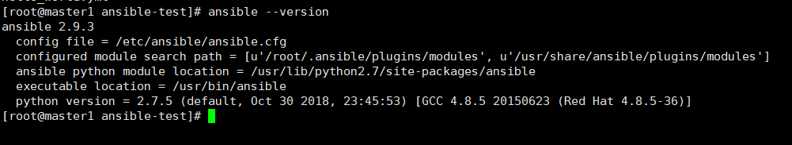

## 20200310

[TOC]

### Ansible主要组成部分

ANSIBLE PLAYBOOKS：任务剧本，编排定义Ansible任务集的配置文件，通常是JSON格式的YML文件

INVENTORY：Ansible管理主机的清单/etc/ansible/hosts

MODULES：Ansible执行命令的功能模块

PLUGINS：模块功能的补充

API：供第三方程序调用的应用程序编程接口

ANSIBLE：ansible命令工具

### 相关文件

配置文件

* /etc/ansible/ansible.cfg  主配置文件
* /etc/ansible/hosts 主机清单
* /etc/ansible/roles/ 存放角色的目录

程序

- /usr/bin/ansible 主程序
- /usr/bin/ansible-doc 查看配置文档
- /usr/bin/ansible-galaxy 上传下载Roles模块的官网平台
- /usr/bin/ansible-playbook 定制自动化任务
- /usr/bin/ansible-vault 文件加密工具

### 主机清单

主机分组

[websrvs]

xxxx

xxxx

[dbsrvs]

xxxx

xxxxx

### 主配置文件

配置项解释

remote_tmp = ~/.ansible/tmp 

local_tmp = ~/.ansible/tmp

remote_port = 22

