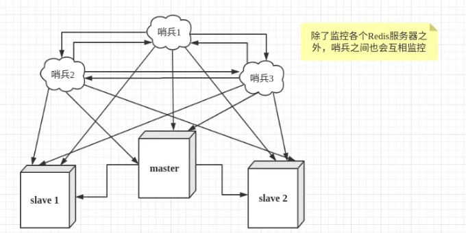

## Redis哨兵参考

[TOC]

### 概述

在实际的生产环境中，单个Redis服务器会发生单点故障，为了避免单点故障，通常的做法是将数据库复制多个副本部署到不同的服务器上面，这样即使有一台服务器出现故障，其它服务器依然可以继续提供服务。为此，Redis提供了主从服务模式。在Redis主从模式的前提下，当Redis主服务器宕机或遇到其它不可恢复的故障情况下，需要把一台从服务器切换为主服务器，通常需要人工干预，费事费力，还会造成一段时间内服务的不可用。更多时候，为了实现高可用以及自动化，我们考虑使用**哨兵模式**。

哨兵的作用就是监控Redis系统的运行状况

* 监控主数据库和从数据库是否正常运行
* 主数据库出现故障的时候，自动将从数据库转换为主数据库

在一个一主多从的Redis系统中，可以使用多个哨兵进行监控任务以保证系统的稳定。如下图所示



### 实验环境介绍

你需要的软件都可以从\\\10.3.2.11\dti\FileServer\LuCheng_WH\ansible-redis目录获取）

环境机器如下：

| 服务类型          | 是否是主服务器 | IP地址      | 端口  |
| ----------------- | -------------- | ----------- | ----- |
| Ansible主控制机器 | 安装ansible2.6 | 10.6.5.209  | -     |
| Redis             | 是             | 10.6.209.19 | 6379  |
| Redis             | 否             | 10.6.209.20 | 6379  |
| Redis             | 否             | 10.6.209.21 | 6379  |
| Sentinel          | -              | 10.6.209.19 | 26379 |
| Sentinel          | -              | 10.6.209.20 | 26379 |
| Sentinel          | -              | 10.6.209.21 | 26379 |

### 安装Redis哨兵

1. 登录10.6.5.209机器，上传解压ansible-redis压缩包到指定目录。

```shell
cd /etc/ansible/roles
tar -xvf ansible-redis.tar
```

2. 修改host文件，末尾添加如下内容

```
[redis-master]
10.6.209.19

[redis-slave]
10.6.209.20
10.6.209.21

[redis-sentinel]
10.6.209.19  redis_sentinel=True
10.6.209.20  redis_sentinel=True
10.6.209.21  redis_sentinel=True
```

3. 准备playbook文件，新建redis-sentinel-pb.yaml。

```yaml
- name: configure the master redis server
  hosts: redis-master
  vars:
    - redis_sentinel: false
    - redis_version: 4.0.11
    - redis_password: ant1r3z
    - redis_tarball: ./redis-4.0.11.tar.gz
  roles:
    - ansible-redis

- name: configure redis slaves
  hosts: redis-slave
  vars:
    - redis_sentinel: false
    - redis_slaveof: 10.6.209.19 6379
    - redis_password: ant1r3z
    - redis_version: 4.0.11
    - redis_tarball: ./redis-4.0.11.tar.gz
  roles:
    - ansible-redis

- name: configure redis sentinel nodes
  hosts: redis-sentinel
  vars:
    - redis_sentinel: true
    - redis_password: ant1r3z
    - redis_sentinel_monitors:
      - name: master01
        host: 10.6.209.19
        port: 6379
        auth_pass: "{{ redis_password }}"
    - redis_version: 4.0.11
    - redis_tarball: ./redis-4.0.11.tar.gz

  roles:
    - ansible-redis
```

3. 执行如下命令运行ansible playbook安装

```shell
# 在redis-sentinel-pb.yaml同级目录执行

[root@master1 test]# ansible-playbook redis-sentinel-pb.yaml 
PLAY [configure the master redis server] ***************************************************************************************************

TASK [Gathering Facts] *********************************************************************************************************************
ok: [10.6.209.19]

TASK [ansible-redis : check for ansible 1.x] ***********************************************************************************************
skipping: [10.6.209.19]

TASK [ansible-redis : check for checksum] **************************************************************************************************
skipping: [10.6.209.19]

TASK [ansible-redis : enable overcommit in sysctl] *****************************************************************************************
ok: [10.6.209.19]

TASK [ansible-redis : create redis install directory] **************************************************************************************
ok: [10.6.209.19]

TASK [ansible-redis : create /etc/redis] ***************************************************************************************************
ok: [10.6.209.19]

......省略很多输出......

PLAY RECAP *********************************************************************************************************************************
10.6.209.19                : ok=40   changed=6    unreachable=0    failed=0    skipped=52   rescued=0    ignored=0   
10.6.209.20                : ok=40   changed=6    unreachable=0    failed=0    skipped=52   rescued=0    ignored=0   
10.6.209.21                : ok=40   changed=6    unreachable=0    failed=0    skipped=52   rescued=0    ignored=0  

```

### 验证哨兵模式

1. 首先验证主从复制是否配置成功。

   master上面执行如下命令，查看主从复制信息，可以看到"role:master，connected_slaves:2"。

```shell
[root@wh-upos--13 redis]# redis-cli
127.0.0.1:6379> auth ant1r3z
OK
127.0.0.1:6379> info replication
# Replication
role:master
connected_slaves:2
slave0:ip=10.6.209.20,port=6379,state=online,offset=1848,lag=1
slave1:ip=10.6.209.21,port=6379,state=online,offset=1848,lag=0
master_replid:5f2de6bd967f5897235af5879931de7a81bfe6cd
master_replid2:0000000000000000000000000000000000000000
master_repl_offset:1862
second_repl_offset:-1
repl_backlog_active:1
repl_backlog_size:1048576
repl_backlog_first_byte_offset:1
repl_backlog_histlen:1862
```

​	salve上面执行如下命令，查看主从复制信息，可以看到"role:slave，master_link_status:up"

``` shell
[root@wh-upos-uiapistress-his redis]# redis-cli
127.0.0.1:6379> auth ant1r3z
OK
127.0.0.1:6379> info replication
# Replication
role:slave
master_host:10.6.209.19
master_port:6379
master_link_status:up
master_last_io_seconds_ago:7
master_sync_in_progress:0
slave_repl_offset:826
slave_priority:100
slave_read_only:1
connected_slaves:0
master_replid:5f2de6bd967f5897235af5879931de7a81bfe6cd
master_replid2:0000000000000000000000000000000000000000
master_repl_offset:826
second_repl_offset:-1
repl_backlog_active:1
repl_backlog_size:1048576
repl_backlog_first_byte_offset:1
repl_backlog_histlen:826
```

2. 验证哨兵配置是否成功

   任何一台机器上面执行如下命令，查看sentinel信息，可以看到"slaves=2,sentinels=3"

```shell
127.0.0.1:26379> info sentinel
# Sentinel
sentinel_masters:1
sentinel_tilt:0
sentinel_running_scripts:0
sentinel_scripts_queue_length:0
sentinel_simulate_failure_flags:0
master0:name=master01,status=ok,address=10.6.209.19:6379,slaves=2,sentinels=3

```

3. 手动模拟主数据库故障，是主从数据库切换是否正常

   关闭主服务器。

```shell
// 在10.6.209.19机器上面执行如下命令关闭redis
[root@wh-upos--13 ~]# systemctl stop redis_6379
[root@wh-upos--13 ~]# ps -ef |grep redis
redis     1630     1  0 13:13 ?        00:00:16 /opt/redis/bin/redis-server 0.0.0.0:26379 [sentinel]
root      1856 28178  0 15:06 pts/0    00:00:00 grep --color=auto redis
```

​		默认等待30s后，故障恢复完成后，可以在两台从服务器上面查看主从复制信息。

```shell
// 在10.6.209.20机器上面查看主从复制信息，发现20机器成为了新的master，10.6.209.21是其slave
[root@wh-upos--19 redis]# redis-cli
127.0.0.1:6379> auth ant1r3z
127.0.0.1:6379> info replication
# Replication
role:master
connected_slaves:1
slave0:ip=10.6.209.21,port=6379,state=online,offset=29158,lag=1
master_replid:bfd4361b6f2ef7e34b16b8e4f630830d866f1ddb
master_replid2:e3da16a6c9b3ff346d050083777afbcf8cc9f678
master_repl_offset:29446
second_repl_offset:15763
repl_backlog_active:1
repl_backlog_size:1048576
repl_backlog_first_byte_offset:1
repl_backlog_histlen:29446
```

​		重新启动19服务器redis实例。查看主从复制信息

```shell
// 在10.6.209.19上面启动redis示例
[root@wh-upos--13 ~]# systemctl start redis_6379
[root@wh-upos--13 ~]# ps -ef |grep redis
redis     1630     1  0 13:13 ?        00:00:18 /opt/redis/bin/redis-server 0.0.0.0:26379 [sentinel]
redis     1868     1  0 15:17 ?        00:00:00 /opt/redis/bin/redis-server *:6379
root      1880 28178  0 15:17 pts/0    00:00:00 grep --color=auto redis

// 在10.6.209.19 上面查看主从复制信息，发现19成为了20的slave
[root@wh-upos--13 ~]# redis-cli
127.0.0.1:6379> auth ant1r3z
OK
127.0.0.1:6379> info replication
# Replication
role:slave
master_host:10.6.209.20
master_port:6379
master_link_status:up
master_last_io_seconds_ago:0
master_sync_in_progress:0
slave_repl_offset:162036
slave_priority:100
slave_read_only:1
connected_slaves:0
master_replid:bfd4361b6f2ef7e34b16b8e4f630830d866f1ddb
master_replid2:0000000000000000000000000000000000000000
master_repl_offset:162036
second_repl_offset:-1
repl_backlog_active:1
repl_backlog_size:1048576
repl_backlog_first_byte_offset:150285
repl_backlog_histlen:11752
```

### 错误记录

主从复制查看info replication显示master_link_status为down状态。


解决方法：

需要设置密码，否则redis为protected mode，主从复制内部建立连接时会报错。

### ansible脚本走读

balabala，文本不做记录